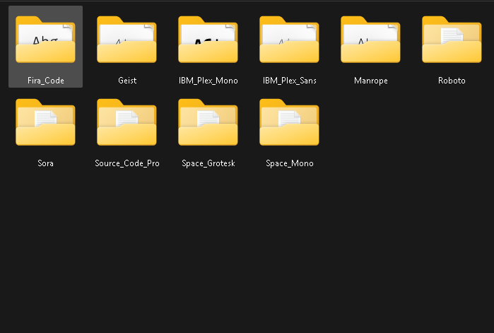

# Font Downloader

One day I was editing a video and needed a bunch of different fonts.

I downloaded them, but then came the annoying part — installing them **one by one**.

If you edit videos, you probably know how annoying that gets.

So I made this little tool.

It lets you scan a folder containing fonts and install **all of them at once**.



## How to use

### 1. Clone the repository

```bash
git clone git@github.com:JustCode13/font-installer.git
cd font-installer
```

### 2. Run it

If you're using `uv`:

```bash
uv run main.py
```

Or with Python:

```bash
python main.py
```

### 3. Select your font folder

The program will ask for the **main folder** containing your fonts.

For example:

```text
Fonts/
├── Font Pack 1/
│   ├── Font1.ttf
│   └── Font2.otf
├── Font Pack 2/
│   ├── Font3.ttf
│   └── Font4.otf
└── Font Pack 3/
    └── Font5.ttf
```

Just give it the location of the `Fonts` folder.

### 4. Scan the folder

Hit **Scan Folder**.

The program will find the fonts inside the folders.

### 5. Install the fonts

Hit **Install Fonts** and let it do its thing.

That's it. No opening every font file and installing them manually.

> **Note:** If a font is already installed, this program will overwrite it.
